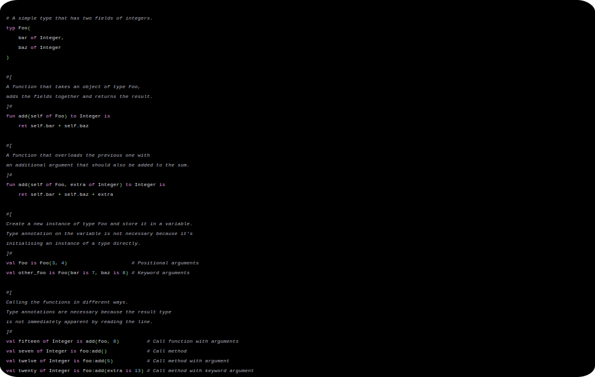

# The Sauce programming language

# Goal
Learn about how compilers work and the choices necessary to create a well-defined programming language.


# Grammar
## Preface
| Representation                                | Meaning                                                                |
|-----------------------------------------------|------------------------------------------------------------------------|
| Plain words or symbols                        | A literal token, representing itself in the exact way it is displayed. |
| Words surrounded by angle brackets `<` `>`    | A single token of that description is required in that position.       |
| Words surrounded by squiggly brackets `{` `}` | An optional single instance of the given tokens. One or none.          |
| Words surrounded by square brackets `[` `]`   | An optional repeating sequence of the given tokens. Many or none.      |

## Abstract Syntax Tree
### Lexemes
| Kind       | Meaning                                                                                                                                                                           |
|------------|-----------------------------------------------------------------------------------------------------------------------------------------------------------------------------------|
| identifier | A word that consists of alphanumberic characters including underscore `_`.<br/>Cannot begin with a digit.                                                                         |
| keyword    | A member of an exclusive collection of reserved words that cannot be used as identifiers. They are used by the compiler to enforce an unambiguous grammar and sentence structure. |
| integer    | A number that exists entirely of digits 0-9 optionally separated by underscore `_`.                                                                                               |
| separator  | A member of a collection of symbols that are used to separate different expressions from each other in ways defined by the grammar.                                               |
| operator   |                                                                                                                                                                                   |
## Definitions
A definition is a type of statement that creates a connection between a given identifier and a value, such that the identifier represents a value.

### Assignment
```
def <identifier> {of <type>} is <statement>

val <identifier> {of <type>} is <statement>

var <identifier> {of <type>} is <statement>
```


### Procedures
```
fun <identifier>({<identifier> of <type> [, <identifier> of <type>]}) to <type> is [<statement>] ret <statement>

pro <identifier>({<identifier> of <type> [, <identifier> of <type>]}) to <type> is [<statement>] ret <statement>
```


### Types

