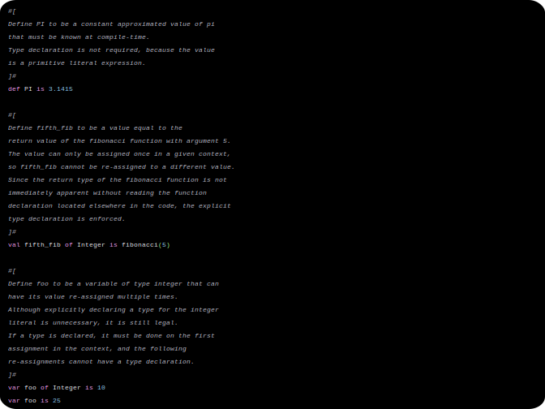
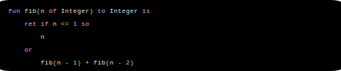

# The Sauce programming language

## Goal
Learn about how compilers work and the choices necessary to create a well-defined programming language.

## Grammar
### Preface
| Representation                                | Meaning                                                                |
|-----------------------------------------------|------------------------------------------------------------------------|
| Plain words                                   | A literal token, representing itself in the exact way it is displayed. |
| Words surrounded by angle brackets `<` `>`    | A single token of that description is required in that position.       |
| Words surrounded by squiggly brackets `{` `}` | An optional single instance of the given tokens. One or none.          |
| Words surrounded by square brackets `[` `]`   | An optional repeating sequence of the given tokens. Many or none.      |

### Declarations
Every declaration must start with a keyword.

#### Assignment
A constant value that must be known at compile time.\
`def <identifier> {of <type>} is <statement>`

A variable that can only be assigned to once.\
`val <identifier> {of <type>} is <statement>`

A variable that has no restrictions on number of assignments.\
`var <identifier> {of <type>} is <statement>`

#### Procedures
A pure function that does not allow side effects.\
`fun <identifier>({<identifier> of <type> [, <identifier> of <type>]}) to <type> is [<statement>] ret <statement>`

A function that allows side effects and returns a value.\
`pro <identifier>({<identifier> of <type> [, <identifier> of <type>]}) to <type> is [<statement>] ret <statement>`

A subroutine that can mutate its arguments in the outer scope and does not return a value.\
`sub <identifier>({<identifier> of <type> [, <identifier> of <type>]}) is [<statement>] end`

